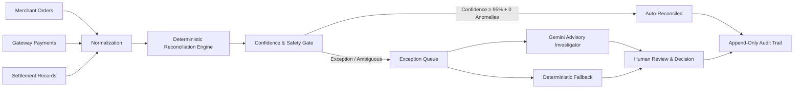

# ReconAI

> **Verification-First AI Finance Controller for Razorpay Merchants**

[](#technology-stack)
[](#verified-benchmark-results)
[-blue.svg)](#verified-benchmark-results)
[](#test-suite--verification)

---

## Pitch

**ReconAI** is a **Verification-First AI Finance Controller**. It closes a finance-ops reconciliation loop over a synthetic benchmark batch, reports operational match rate and throughput, and explicitly identifies exceptions that remain unresolved for human review backed by an append-only audit trail.


---

## The Problem

Finance operations teams at e-commerce merchants spend hundreds of hours manually reconciling orders against gateway payments and bank payouts. 

- **Manual reconciliation** using static spreadsheets is slow, expensive, and error-prone.
- **Blind LLM automation** is dangerous—if an unconstrained AI model makes a hallucinated decision on missing or ambiguous financial data, funds are misallocated without safety gates or compliance auditability.

---

## The Solution: Verification-First Architecture

ReconAI introduces a **Verification-First Architecture** where deterministic rules establish financial truth, safety gates lock out uncertainty, Gemini AI provides root-cause advisory insights, and human operators retain final resolution authority.



### Core Architecture Principles

1. **Deterministic Matching Engine**: 100% pure, in-memory matching engine operating with integer paise math. GroundTruth answer keys are strictly isolated and never accessed during reconciliation.
2. **Confidence Safety Gate**: Auto-reconciliation strictly requires ≥95% evidence confidence AND zero anomaly flags.
3. **AI Advisory Boundary**: Google Gemini model is invoked strictly on-demand for exception root-cause investigation. It cannot mutate financial classifications or move funds.
4. **Append-Only Audit Trail**: Every batch run, AI request, and human decision is logged immutably with automatic credential sanitization (`[REDACTED]`).

---

## Key Features

- **3-Way Reconciliation**: Reconciles Merchant Orders, Gateway Payments, and Payout Settlement line items.
- **12 Supported Anomaly Classifications**: `MATCHED`, `AMOUNT_MISMATCH`, `MISSING_PAYMENT`, `MISSING_SETTLEMENT`, `DUPLICATE_PAYMENT`, `DUPLICATE_SETTLEMENT`, `FEE_MISMATCH`, `REFUND_MISMATCH`, `REFERENCE_MISMATCH`, `STATUS_MISMATCH`, `AMBIGUOUS`, `INVALID_DATA`.
- **120-Scenario Benchmark Suite**: Pre-seeded synthetic benchmark dataset (`RECONAI_DEMO_V1`, seed `RECONAI_DEMO_2026`).
- **Graceful Failure Showcase (`ORD-000116`)**: When multiple payment candidates exist, ReconAI scores confidence at 45%, blocks automatic resolution, and forces manual review.
- **On-Demand Gemini AI Investigator**: Integrated via official `@google/genai` SDK with Zod runtime validation and 15s timeout policy.
- **Deterministic AI Fallback**: Provides structured, rule-backed explanations if the AI provider is unavailable.
- **Human Decision Workflow**: Human operators choose `KEEP_EXCEPTION`, `APPROVE_MATCH`, or `MARK_RESOLVED`, preserving the original deterministic classification for audit compliance.
- **Razorpay Test Mode Read-Only Adapter**: Fetches live payments (`/v1/payments`) and settlements (`/v1/settlements/recon/combined`) with `validateTestModeSafety()` key protection and customer PII stripping.
- **High-Density React Dashboard**: Built with Vite, React, Tailwind CSS, Recharts, and Lucide React.

---

## Verified Benchmark Results

Measured against pre-seeded synthetic benchmark dataset (`RECONAI_DEMO_V1`):

| Metric | Value | Details |
| :--- | :---: | :--- |
| **Total Scenarios Processed** | **120** | 80 MATCHED, 40 Exceptions |
| **Classification Accuracy** | **100.00%** | 120 / 120 Exact Matches |
| **Exception Precision** | **100.00%** | Zero False Positives |
| **Exception Recall** | **100.00%** | Zero False Negatives |
| **F1 Score** | **100.00%** | Harmonic Mean |
| **Total Value Processed** | **₹10,30,180.00** | 103,018,000 paise |
| **Auto-Reconciled Value** | **₹7,17,020.00** | 71,702,000 paise (80 MATCHED orders) |
| **Held Under Review Value** | **₹3,13,160.00** | 31,316,000 paise (40 Anomaly orders) |

*Note: These 100% metrics are measured against our isolated synthetic GroundTruth benchmark dataset to prove algorithmic correctness, not claimed as universal real-world performance.*

---

## Graceful Failure Showcase: Order `ORD-000116`

ReconAI's core strength is **responsible uncertainty handling**:

- Scenario `ORD-000116` contains two candidate gateway payments (`PAY-000116-A` and `PAY-000116-B`) matching reference parameters with unlinked settlement records.
- Naive algorithms guess; ReconAI scores evidence confidence at **45%** and deterministically classifies the scenario as `AMBIGUOUS`.
- The safety gate locks out automatic resolution and displays:
  > **`Automatic Reconciliation Blocked — Manual Review Required`**
- Gemini or the deterministic fallback explains the candidate ambiguity to the human reviewer.
- Human operator applies `KEEP_EXCEPTION`, leaving the workflow status as `UNDER_REVIEW` while preserving the `AMBIGUOUS` classification for compliance audit.

---

## Safety Invariants Matrix

| Safety Question | Enforced Answer | Implementation Safeguard |
| :--- | :---: | :--- |
| Can Gemini change transaction match classification? | **NO** | Gemini output Zod schema rejects execution actions; matching engine is deterministic. |
| Can Gemini automatically resolve an exception case? | **NO** | AI is advisory-only (`POST /api/exceptions/:id/investigate`). Human action required. |
| Can Gemini be invoked during batch reconciliation? | **NO** | Excluded from batch run orchestration (`reconciliationService.js`). |
| Can an anomaly auto-reconcile because confidence is high? | **NO** | Safety gate forces `allowedAutomaticResolution = false` for all non-MATCHED classes. |
| Can Razorpay adapter perform captures, refunds, or payouts? | **NO** | Adapter uses HTTP GET requests only (`razorpayClient.js`). |
| Can live Razorpay keys (`rzp_live_`) be used in Test Mode? | **NO** | `validateTestModeSafety()` throws AppError exception on `rzp_live_` keys. |
| Can GroundTruth answer keys influence matching decisions? | **NO** | GroundTruth imports forbidden in `server/src/services/reconciliation/` (`groundTruthIsolationGuard.test.js`). |
| Can audit trail records be modified or deleted via API? | **NO** | Audit API provides `GET /api/audit` and `GET /api/audit/:id` only. |

---

## Technology Stack

- **Frontend**: React 18, Vite 5, JavaScript, Tailwind CSS 4, React Router 6, Axios, Recharts, Lucide React
- **Backend**: Node.js 20, Express 4, MongoDB Atlas, Mongoose 8, Zod 3, Pino, Helmet, express-rate-limit
- **AI Engine**: Google Gemini API (`@google/genai` SDK, `gemini-2.5-flash`)
- **Payment Sync Adapter**: Razorpay REST API Test Mode
- **Testing**: Vitest 1.6, Supertest 7

---

## Quick Start & Local Setup

### Prerequisites

- Node.js v18+ installed
- MongoDB Atlas URI or local MongoDB server

### Installation

```bash
# 1. Clone the repository
git clone https://github.com/Pranjal-k22/ReconAI.git
cd ReconAI

# 2. Install dependencies for monorepo
npm install
cd server && npm install
cd ../client && npm install
cd ..
```

### Environment Configuration

Create `server/.env`:
```env
PORT=5000
NODE_ENV=development
CLIENT_URL=http://localhost:5173
MONGODB_URI=your_mongodb_atlas_uri_here

# Optional AI & Integration Keys:
GEMINI_API_KEY=your_gemini_api_key_here
GEMINI_MODEL=gemini-2.5-flash

RAZORPAY_KEY_ID=your_razorpay_test_key_id
RAZORPAY_KEY_SECRET=your_razorpay_test_key_secret
RAZORPAY_MODE=test
```

Create `client/.env`:
```env
VITE_API_BASE_URL=http://localhost:5000/api
```

### Seed Benchmark Data & Start Servers

```bash
# Seed 120-scenario synthetic benchmark dataset into MongoDB
cd server
npm run demo:seed

# Start frontend and backend concurrently from root
cd ..
npm run dev
```

Open browser at `http://localhost:5173`.

---

## Test Suite & Verification

Run backend unit and integration tests (170 tests):
```bash
cd server
npm test
```

Build production client bundle:
```bash
cd client
npm run build
```

---

## Major REST API Endpoints

- `GET /api/health` — System health & DB connection status
- `POST /api/reconciliation/runs` — Trigger batch reconciliation run
- `GET /api/reconciliation/runs` — List reconciliation runs with pagination
- `GET /api/reconciliation/runs/:runId/results` — Fetch filterable run results
- `GET /api/reconciliation/runs/:runId/evaluation` — Evaluate run accuracy against GroundTruth
- `GET /api/exceptions` — List exception queue records
- `POST /api/exceptions/:exceptionId/investigate` — Trigger AI / Fallback investigation
- `PATCH /api/exceptions/:exceptionId/decision` — Submit human review decision
- `GET /api/audit` — Query append-only audit trail
- `GET /api/integrations/status` — Get safe integration status (Gemini, Razorpay, DB)
- `POST /api/razorpay/sync/payments` — Sync Razorpay Test Mode payments (read-only)

---

## Documentation Links

- [Demo Script Guide (`docs/DEMO_SCRIPT.md`)](file:///c:/WEB%20DEVELOPMENT/ReconAI/docs/DEMO_SCRIPT.md)
- [Judging Criteria Alignment (`docs/JUDGING_CRITERIA.md`)](file:///c:/WEB%20DEVELOPMENT/ReconAI/docs/JUDGING_CRITERIA.md)
- [Submission Checklist (`docs/SUBMISSION_CHECKLIST.md`)](file:///c:/WEB%20DEVELOPMENT/ReconAI/docs/SUBMISSION_CHECKLIST.md)
- [REST API Specification (`docs/API.md`)](file:///c:/WEB%20DEVELOPMENT/ReconAI/docs/API.md)
- [Testing Architecture (`docs/TESTING.md`)](file:///c:/WEB%20DEVELOPMENT/ReconAI/docs/TESTING.md)
- [Elevator Pitch (`docs/PITCH.md`)](file:///c:/WEB%20DEVELOPMENT/ReconAI/docs/PITCH.md)
- [Exception Workflow (`docs/EXCEPTION_WORKFLOW.md`)](file:///c:/WEB%20DEVELOPMENT/ReconAI/docs/EXCEPTION_WORKFLOW.md)
- [AI Investigation Architecture (`docs/AI_INVESTIGATION.md`)](file:///c:/WEB%20DEVELOPMENT/ReconAI/docs/AI_INVESTIGATION.md)
- [Razorpay Integration (`docs/RAZORPAY_INTEGRATION.md`)](file:///c:/WEB%20DEVELOPMENT/ReconAI/docs/RAZORPAY_INTEGRATION.md)

---

## Limitations

- Synthetic benchmark is a controlled dataset (120 scenarios).
- Razorpay live financial operations (captures, refunds, payouts) are intentionally unsupported; integration is strictly read-only Test Mode GET requests.
- Razorpay synchronization stores records in MongoDB but requires explicit merchant-order mapping before reconciliation execution.
- Customer authentication is not included in the hackathon demo build (default actor: `demo-finance-reviewer`).

---

## License

MIT License — ReconAI Hackathon Team
