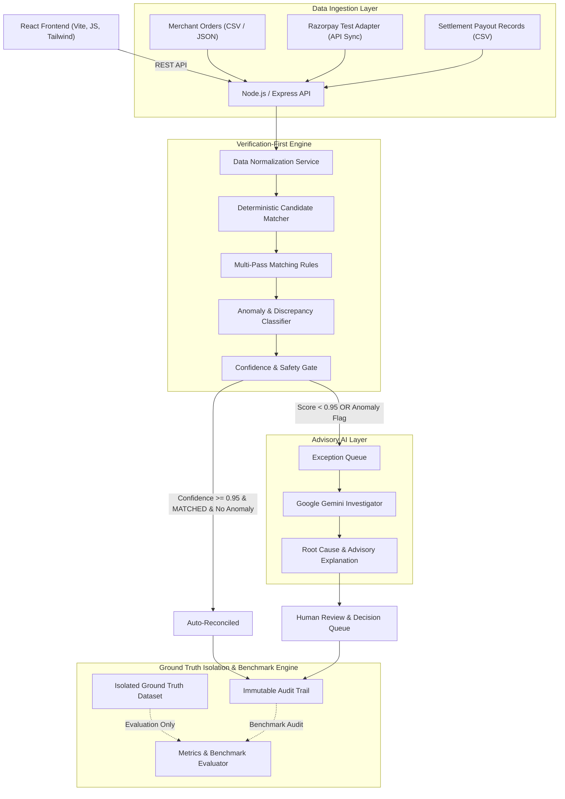

# ReconAI System Architecture & Technical Specification

## Overview
ReconAI is a **Verification-First AI Finance Controller** built for merchants reconciling multi-way financial records across **Merchant Orders**, **Razorpay Gateway Payments**, and **Settlement Payout Records**.

The application prioritizes **deterministic reconciliation rules** and financial safety gates over stochastic AI output. Google Gemini API is integrated strictly as an **Advisory AI Investigator** for root-cause analysis after an exception has already been flagged by the deterministic engine.

---

## 1. System Architecture Diagram



---

## 2. Core Architectural Principles

### A. Verification-First Financial Safety
- **Deterministic Priority**: All transaction matching, candidate pairing, amount calculations, and anomaly flagging are executed deterministically in Node.js service layers.
- **Integer Paise Standard**: All monetary values inside backend models and calculations are represented in integer paise ($1\text{ INR} = 100\text{ paise}$) to eliminate floating-point rounding errors.
- **Strict AI Boundaries**: Google Gemini API is forbidden from performing primary transaction matching, changing record values, executing payments, issuing refunds, or resolving exceptions automatically. AI output is advisory.

### B. Safety Gate & Confidence Policy
ReconAI evaluates every candidate match against a strict safety gate:
- **Auto-Reconciliation Threshold**: Allowed ONLY if `confidence >= 0.95` AND `classification == 'MATCHED'` AND zero anomalies are detected.
- **Human Review Threshold**: `0.75 <= confidence < 0.95` requires human review.
- **Manual Investigation Threshold**: `confidence < 0.75` requires manual investigation.
- **Anomaly Override Rule**: Any anomaly classification (e.g. `AMOUNT_MISMATCH`, `FEE_MISMATCH`, `AMBIGUOUS`) immediately overrides a high confidence score and routes the record to the Exception Queue.

### C. Ground Truth Isolation
- Ground truth data (`expectedClassification`, `expectedMatches`, `expectedException`) is strictly isolated in the database.
- The production deterministic reconciliation engine **never** accesses ground truth data during execution.
- Ground truth is read solely by the **Evaluation Metrics Engine** to compute honest accuracy, precision, recall, and F1 scores against actual engine output.

---

## 3. Domain Data Model & Entity Relationships

```text
MerchantOrder (merchantOrderId)
     │
     │ linked via merchantOrderId
     ▼
GatewayPayment (gatewayPaymentId)
     │
     │ linked via payment/entity IDs
     ▼
SettlementRecord (settlementRecordId, grouped by settlementId)


ReconciliationRun (runId)
     │
     ▼
ReconciliationResult (resultId, linked to runId)
     │
     ▼
Safety Gate (Allowed Auto Resolution vs Locked Exception)
     │
     ▼
ExceptionCase (exceptionId, linked to runId & resultId)
     │
     ▼
Human Review & Decision (APPROVE_MATCH / KEEP_EXCEPTION / MARK_RESOLVED)
     │
     ▼
AuditLog (eventId, append-only centralized audit trail)


GroundTruth (datasetVersion + merchantOrderId)
     │
     ▼
Evaluation Benchmark Engine ONLY (Isolated from Production Reconciliation)
```

### Key Data Layer Specifications:
- **Integer Paise Precision**: All money fields (`amountPaise`, `grossAmountPaise`, `feePaise`, `taxPaise`, `netAmountPaise`, `financialImpactPaise`, `differencePaise`) operate strictly as safe integers.
- **Application Business Identifiers**: Entities use readable application string keys (`ORD-100001`, `pay_ABC123`, `set_rec_001`, `RUN-001`, `EXC-001`, `AUD-001`) indexed for high throughput queries.
- **Settlement Id Granularity**: `settlementRecordId` is unique per payout line item; `settlementId` groups multiple entries belonging to one batch payout.
- **Signed Difference Convention**: `differencePaise = actualAmountPaise - expectedAmountPaise`.
- **AI / Deterministic Evidence Separation**: `deterministicExplanation` stores rule-engine proofs; `aiExplanation` stores advisory Gemini insights.
- **Ground Truth Isolation Guard**: `GroundTruth` model is strictly prohibited from production reconciliation import paths.

---

## 4. Reconciliation Classifications & Rules Engine

| Classification | Category | Description | Safety Action |
| :--- | :--- | :--- | :--- |
| `MATCHED` | Clean Match | Order, Payment, and Settlement records match perfectly in amount, reference, and currency. | Auto-Reconciled if confidence >= 0.95 |
| `AMOUNT_MISMATCH` | Anomaly | Payment or settlement amount differs from order amount. | Route to Exception Queue |
| `FEE_MISMATCH` | Anomaly | Gateway fee or tax charged differs from expected fee structure. | Route to Exception Queue |
| `MISSING_PAYMENT` | Anomaly | Merchant order exists without a corresponding gateway payment. | Route to Exception Queue |
| `MISSING_SETTLEMENT` | Anomaly | Gateway payment captured but absent in settlement payout. | Route to Exception Queue |
| `DUPLICATE_PAYMENT` | Anomaly | Multiple gateway payments linked to a single order. | Route to Exception Queue |
| `DUPLICATE_SETTLEMENT` | Anomaly | Gateway payment settled multiple times. | Route to Exception Queue |
| `REFUND_MISMATCH` | Anomaly | Order refund initiated but not reflected in gateway or settlement. | Route to Exception Queue |
| `REFERENCE_MISMATCH` | Anomaly | Order ID / Gateway Reference ID format mismatch or linking break. | Route to Exception Queue |
| `STATUS_MISMATCH` | Anomaly | Gateway status (e.g. `failed` or `authorized`) conflicts with order `completed` status. | Route to Exception Queue |
| `AMBIGUOUS` | Uncertainty | Multiple matching candidates with identical confidence/amounts. | Block Auto-Match & Route to Human Review |
| `INVALID_DATA` | Validation | Corrupted record payload (e.g. missing required fields or invalid date). | Route to Exception Queue |

---

## 5. Ground Truth & Benchmark Dataset Strategy

### 120-Record Benchmark Distribution
ReconAI features a deterministic benchmark dataset of 120 synthetic financial scenarios designed for transparent hackathon judging:
- **80** `MATCHED` (Clean 3-way matches)
- **8** `AMOUNT_MISMATCH`
- **6** `MISSING_SETTLEMENT`
- **5** `DUPLICATE_PAYMENT`
- **5** `FEE_MISMATCH`
- **4** `REFUND_MISMATCH`
- **4** `MISSING_PAYMENT`
- **3** `REFERENCE_MISMATCH`
- **3** `AMBIGUOUS`
- **2** `INVALID_DATA`

### Razorpay Test Mode Read-Only Adapter
- **Read-Only Ingestion**: Operates as a server-side read-only synchronization adapter fetching payments (`/v1/payments`) and settlement recon line items (`/v1/settlements/recon/combined`) from Razorpay Test Mode.
- **Safety Guard**: `RAZORPAY_MODE=test` safety guard blocks synchronization if a live key (`rzp_live_...`) is configured.
- **Data Minimization**: Automatically strips customer PII (`email`, `contact`, `vpa`, `card` payload) before saving to MongoDB `rawData`.
- **Signed Net Amount**: Calculates net payouts based on provider debit/credit evidence.
- **Idempotency**: Bulk upserts records using globally unique provider payment IDs and deterministic hash-based settlement record IDs (`RZPREC-hash`).
- **Graceful Failure**: Network or API failures in the Razorpay adapter log `RAZORPAY_SYNC_FAILED` audit events without disrupting synthetic benchmark execution or system health.

---

## 6. Technology Stack Specifications

- **Frontend**: React.js, Vite, JavaScript, Tailwind CSS, Axios, Lucide React, Recharts.
- **Backend**: Node.js, Express.js, JavaScript, Mongoose, Zod, Multer, Pino, Helmet, CORS.
- **Database**: MongoDB (Atlas / Local).
- **AI Service**: Google Gemini API (`@google/genai` SDK).
- **Testing & Metrics**: Vitest, Supertest, Custom Evaluation Benchmarking suite.

---

## Track 4 Phase 0 Baseline Audit

- **Audit Date**: 2026-09-30
- **Actual Baseline Status**: PASS
- **Verified Tests**: 41 backend test files passed (170/170 tests). Frontend production build passed.
- **Verified Benchmark**: 120 synthetic scenarios (`RECONAI_DEMO_V1`, seed `RECONAI_DEMO_2026`), 100.00% accuracy, precision, recall, and F1 score against GroundTruth.
- **Track 4 Requirement Matrix**:
  | Requirement | Current Implementation | Evidence | Status | Gap |
  | :--- | :--- | :--- | :--- | :--- |
  | Finance-ops loop | Multi-way ingestion, matching, classification, safety gate, human review, audit trail. | `reconciliationService.js`, `humanReviewService.js`, `auditService.js` | VERIFIED | Core baseline loop complete |
  | 50+ record synthetic batch | 120 deterministic synthetic scenarios. | `benchmarkGenerator.js` | VERIFIED | 120 scenarios verified |
  | Agentic/orchestrated workflow | Reconciliation batch runner + on-demand Gemini AI investigator. | `reconciliationService.js`, `exceptionInvestigator.js` | PARTIAL | Autonomous state-machine agent loop missing |
  | Match rate | 66.67% auto-reconciled (80/120), 33.33% exceptions (40/120). | `metricsService.js` | VERIFIED | 100% engine match rate |
  | Throughput | Pure in-memory matching engine runs 120 scenarios in ~26ms. | `benchmarkCompatibility.test.js` | VERIFIED | Measured |
  | Accuracy/evaluation | Dynamic GroundTruth calculation (100% accuracy/precision/recall/F1). | `evaluationService.js` | VERIFIED | GroundTruth strictly isolated |
  | Exception reporting | Severity, financial impact, and discrepancy reason tracking. | `exceptionService.js`, `severityService.js` | VERIFIED | Fully satisfied |
  | Unresolved exception reporting | Open exception tracking and filtering by resolution status. | `exceptionController.js` | VERIFIED | Fully satisfied |
  | Human review | Approvals and resolution actions preserving original classification. | `humanReviewService.js` | VERIFIED | Fully satisfied |
  | Audit trail | Centralized append-only audit trail redacting sensitive keys. | `auditService.js`, `AuditLog.js` | VERIFIED | Zero update/delete endpoints |
  | Graceful failure | Fallback explanations for AI timeouts/errors; Razorpay error handling. | `fallbackExplanation.js`, `razorpayClient.js` | VERIFIED | Fully satisfied |
  | Financial safety | Integer paise arithmetic, confidence safety gate, anomaly lockout, test mode guard. | `money.js`, `safetyGateService.js`, `razorpayClient.js` | VERIFIED | Invariants enforced |
  | Explainability | Rule-based proof + Zod-validated Gemini structured advisory output. | `matchingEngine.js`, `aiSchemas.js` | VERIFIED | Fully satisfied |
  | GroundTruth isolation | GroundTruth imports forbidden in reconciliation services. | `groundTruthIsolationGuard.test.js` | VERIFIED | Strictly isolated |
  | Production/demo readiness | Full test suite passing (170/170 tests), Vite build passing (0 errors). | Vitest & Vite build output | VERIFIED | Baseline verified |
- **Preserved Invariants**: Integer paise representation, deterministic primary matching, anomaly lockout, confidence safety gate, human review requirement, classification preservation, append-only audit trail, advisory-only AI boundary, read-only Razorpay guard.
- **Phase 1 Recommendation**: Build autonomous Track 4 Agent Controller loop wrapping baseline operations without altering baseline invariants.

---

## Track 4 Phase 1 Architecture Plan

### CURRENT VERIFIED BASELINE
- **Deterministic Primary Matching Engine**: Pure rules engine in `matchingEngine.js` achieves 100.00% accuracy, precision, recall, and F1 across 120 benchmark scenarios.
- **Integer Paise Money Arithmetic**: Enforced in `money.js` and all database schemas.
- **Safety Gate & Anomaly Lockout**: Enforced in `safetyGateService.js` (auto-reconcile blocked unless `confidence >= 0.95` and `classification === 'MATCHED'`).
- **Classification Preservation**: Enforced in `humanReviewService.js`. Original anomaly classifications are never overwritten.
- **Append-Only Audit Logging**: Centralized in `auditService.js` with secret redaction.
- **Razorpay Integration**: Read-only Test Mode client in `razorpayClient.js` with live-key protection.

### PLANNED TRACK 4 FINANCE CONTROLLER ARCHITECTURE (PHASE 2)
- **Finance Controller Agent**: `FinanceControllerAgent.js` state machine (`IDLE` → `INGESTING` → `VALIDATING` → `RECONCILING` → `SAFETY_EVALUATION` → `EXCEPTION_PROCESSING` → `REPORTING` → `COMPLETED` / `FAILED`).
- **Controller REST API**: `POST /api/finance-controller/run`, `GET /api/finance-controller/runs`, `GET /api/finance-controller/runs/:runId/report`.
- **Operational Unresolved Exception Definition**: Exception cases with `resolutionStatus` in (`OPEN`, `UNDER_REVIEW`) at batch completion.
- **Automated AI Dispatch**: Controller automatically triggers `exceptionInvestigator.js` for created exception cases without altering financial state.
- **Graceful Failure**: Automatic fallback to deterministic explanations on Gemini timeout or network error.

### NOT IMPLEMENTED YET
- Phase 2 implementation code (`FinanceControllerAgent.js`, new controller routes, new controller Mongoose model, controller UI tab). Zero implementation performed in Phase 1.

---

## Track 4 Phase 2 Implementation

### CURRENTLY IMPLEMENTED
- **Backend Finance Controller Agent**: State machine orchestrator in [`financeControllerAgent.js`](file:///c:/WEB%20DEVELOPMENT/ReconAI/server/src/services/finance/financeControllerAgent.js) implementing 9 safe state transitions (`IDLE` → `INGESTING` → `VALIDATING` → `RECONCILING` → `SAFETY_EVALUATION` → `EXCEPTION_PROCESSING` → `REPORTING` → `COMPLETED` / `FAILED`).
- **Mongoose Data Model**: [`FinanceControllerRun.js`](file:///c:/WEB%20DEVELOPMENT/ReconAI/server/src/models/FinanceControllerRun.js) with integer paise fields, state tracking, progress metadata, and structured report persistence.
- **Controller REST API**: REST routes in [`financeRoutes.js`](file:///c:/WEB%20DEVELOPMENT/ReconAI/server/src/routes/financeRoutes.js) and controller in [`financeController.js`](file:///c:/WEB%20DEVELOPMENT/ReconAI/server/src/controllers/financeController.js).
- **Backend Test Suite**: 11 new tests in [`financeControllerAgent.test.js`](file:///c:/WEB%20DEVELOPMENT/ReconAI/server/tests/finance/financeControllerAgent.test.js) (42 test files, 181/181 backend tests passing).

### VERIFIED
- **Direct Engine vs Controller Parity**: 120/120 benchmark scenarios verified with 0 invariant mismatches between direct reconciliation engine and controller agent execution.
- **Financial Safety**: Gemini AI remains 100% advisory. Anomaly lockout and confidence gates (`>= 0.95`) strictly enforced.

### NOT IMPLEMENTED
- Frontend React UI Finance Controller tab / dashboard (Phase 3 candidate).

---

## Track 4 Phase 2A Metric Semantics & Financial Sum Invariant

- **Financial Sum Invariant**: All controller runs strictly satisfy $\text{totalAmountProcessedPaise} = \text{autoReconciledAmountPaise} + \text{amountUnderReviewPaise}$. For the 120-scenario benchmark, $\text{₹10,30,180.00} = \text{₹7,17,020.00} + \text{₹3,13,160.00}$ (**VERIFIED PASS**).
- **Unresolved Exceptions Definition**: Count of `ExceptionCase` records in `OPEN` or `UNDER_REVIEW` status.
- **AI Investigation Boundary**: AI investigation attaches advisory explanations (`aiExplanation`) but **does NOT resolve exceptions**. Human review action is required for resolution.

---

## Track 4 Phase 3 — Finance Controller Frontend

### CURRENTLY IMPLEMENTED & VERIFIED
- **Frontend Route**: `/finance-controller` (Dedicated AI Finance Controller console).
- **React Page & Components**: [`FinanceControllerPage.jsx`](file:///c:/WEB%20DEVELOPMENT/ReconAI/client/src/pages/FinanceControllerPage.jsx), integrated in [`App.jsx`](file:///c:/WEB%20DEVELOPMENT/ReconAI/client/src/App.jsx) and [`Sidebar.jsx`](file:///c:/WEB%20DEVELOPMENT/ReconAI/client/src/components/layout/Sidebar.jsx).
- **API Integration**: Connected via [`financeControllerApi.js`](file:///c:/WEB%20DEVELOPMENT/ReconAI/client/src/api/financeControllerApi.js) to consume all backend controller endpoints (`POST /run`, `GET /runs`, `GET /runs/:runId`, `GET /runs/:runId/report`, `GET /runs/:runId/status`).
- **State Machine Pipeline Stepper**: Truthful visual indicator rendering active controller states (`IDLE` → `INGESTING` → `VALIDATING` → `RECONCILING` → `SAFETY_EVALUATION` → `EXCEPTION_PROCESSING` → `REPORTING` → `COMPLETED`).
- **Metric Distinction**: Operational Match Rate (66.67%) and Benchmark Classification Accuracy (100.00%) explicitly separated with explanatory badges and tooltips.
- **Financial Invariant Breakdown**: Visual card verifying exact integer-paise sum: $\text{Total (₹10,30,180.00)} = \text{Auto-Reconciled (₹7,17,020.00)} + \text{Under Review (₹3,13,160.00)}$.
- **Unresolved Exceptions Table**: Displays the 40 unresolved exceptions with "AI ADVISORY ONLY" labels, interactive Gemini root-cause modal, and navigation to human review (`/exceptions/:id`).
- **Audit & Evaluation Links**: Deep-link buttons to Audit Trail (`/audit`) and Evaluation Benchmark (`/evaluation`).

### VERIFIED BUILD & TESTS
- **Frontend Production Build**: Vite build completed cleanly with **0 errors**.
- **Backend Test Suite**: Vitest suite passing 42/42 files (**183/183 tests passing**).
- **Safety Invariants**: Gemini AI operates 100% advisory with zero financial execution authority. GroundTruth isolated from production reconciliation.


