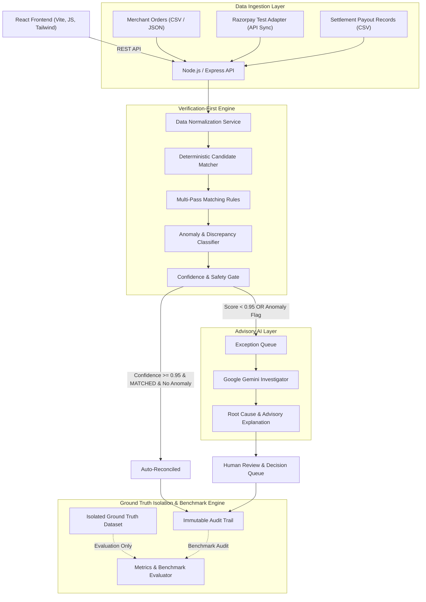

# ReconAI System Architecture & Technical Specification

## Overview
ReconAI is a **Verification-First AI Finance Controller** built for merchants reconciling multi-way financial records across **Merchant Orders**, **Razorpay Gateway Payments**, and **Settlement Payout Records**.

The application prioritizes **deterministic reconciliation rules** and financial safety gates over stochastic AI output. Google Gemini API is integrated strictly as an **Advisory AI Investigator** for root-cause analysis after an exception has already been flagged by the deterministic engine.

---

## 1. System Architecture Diagram



---

## 2. Core Architectural Principles

### A. Verification-First Financial Safety
- **Deterministic Priority**: All transaction matching, candidate pairing, amount calculations, and anomaly flagging are executed deterministically in Node.js service layers.
- **Integer Paise Standard**: All monetary values inside backend models and calculations are represented in integer paise ($1\text{ INR} = 100\text{ paise}$) to eliminate floating-point rounding errors.
- **Strict AI Boundaries**: Google Gemini API is forbidden from performing primary transaction matching, changing record values, executing payments, issuing refunds, or resolving exceptions automatically. AI output is advisory.

### B. Safety Gate & Confidence Policy
ReconAI evaluates every candidate match against a strict safety gate:
- **Auto-Reconciliation Threshold**: Allowed ONLY if `confidence >= 0.95` AND `classification == 'MATCHED'` AND zero anomalies are detected.
- **Human Review Threshold**: `0.75 <= confidence < 0.95` requires human review.
- **Manual Investigation Threshold**: `confidence < 0.75` requires manual investigation.
- **Anomaly Override Rule**: Any anomaly classification (e.g. `AMOUNT_MISMATCH`, `FEE_MISMATCH`, `AMBIGUOUS`) immediately overrides a high confidence score and routes the record to the Exception Queue.

### C. Ground Truth Isolation
- Ground truth data (`expectedClassification`, `expectedMatches`, `expectedException`) is strictly isolated in the database.
- The production deterministic reconciliation engine **never** accesses ground truth data during execution.
- Ground truth is read solely by the **Evaluation Metrics Engine** to compute honest accuracy, precision, recall, and F1 scores against actual engine output.

---

## 3. Domain Data Model & Entity Relationships

```text
MerchantOrder (merchantOrderId)
     │
     │ linked via merchantOrderId
     ▼
GatewayPayment (gatewayPaymentId)
     │
     │ linked via payment/entity IDs
     ▼
SettlementRecord (settlementRecordId, grouped by settlementId)


ReconciliationRun (runId)
     │
     ▼
ReconciliationResult (resultId, linked to runId)
     │
     ▼
Safety Gate (Allowed Auto Resolution vs Locked Exception)
     │
     ▼
ExceptionCase (exceptionId, linked to runId & resultId)
     │
     ▼
Human Review & Decision (APPROVE_MATCH / KEEP_EXCEPTION / MARK_RESOLVED)
     │
     ▼
AuditLog (eventId, append-only centralized audit trail)


GroundTruth (datasetVersion + merchantOrderId)
     │
     ▼
Evaluation Benchmark Engine ONLY (Isolated from Production Reconciliation)
```

### Key Data Layer Specifications:
- **Integer Paise Precision**: All money fields (`amountPaise`, `grossAmountPaise`, `feePaise`, `taxPaise`, `netAmountPaise`, `financialImpactPaise`, `differencePaise`) operate strictly as safe integers.
- **Application Business Identifiers**: Entities use readable application string keys (`ORD-100001`, `pay_ABC123`, `set_rec_001`, `RUN-001`, `EXC-001`, `AUD-001`) indexed for high throughput queries.
- **Settlement Id Granularity**: `settlementRecordId` is unique per payout line item; `settlementId` groups multiple entries belonging to one batch payout.
- **Signed Difference Convention**: `differencePaise = actualAmountPaise - expectedAmountPaise`.
- **AI / Deterministic Evidence Separation**: `deterministicExplanation` stores rule-engine proofs; `aiExplanation` stores advisory Gemini insights.
- **Ground Truth Isolation Guard**: `GroundTruth` model is strictly prohibited from production reconciliation import paths.

---

## 4. Reconciliation Classifications & Rules Engine

| Classification | Category | Description | Safety Action |
| :--- | :--- | :--- | :--- |
| `MATCHED` | Clean Match | Order, Payment, and Settlement records match perfectly in amount, reference, and currency. | Auto-Reconciled if confidence >= 0.95 |
| `AMOUNT_MISMATCH` | Anomaly | Payment or settlement amount differs from order amount. | Route to Exception Queue |
| `FEE_MISMATCH` | Anomaly | Gateway fee or tax charged differs from expected fee structure. | Route to Exception Queue |
| `MISSING_PAYMENT` | Anomaly | Merchant order exists without a corresponding gateway payment. | Route to Exception Queue |
| `MISSING_SETTLEMENT` | Anomaly | Gateway payment captured but absent in settlement payout. | Route to Exception Queue |
| `DUPLICATE_PAYMENT` | Anomaly | Multiple gateway payments linked to a single order. | Route to Exception Queue |
| `DUPLICATE_SETTLEMENT` | Anomaly | Gateway payment settled multiple times. | Route to Exception Queue |
| `REFUND_MISMATCH` | Anomaly | Order refund initiated but not reflected in gateway or settlement. | Route to Exception Queue |
| `REFERENCE_MISMATCH` | Anomaly | Order ID / Gateway Reference ID format mismatch or linking break. | Route to Exception Queue |
| `STATUS_MISMATCH` | Anomaly | Gateway status (e.g. `failed` or `authorized`) conflicts with order `completed` status. | Route to Exception Queue |
| `AMBIGUOUS` | Uncertainty | Multiple matching candidates with identical confidence/amounts. | Block Auto-Match & Route to Human Review |
| `INVALID_DATA` | Validation | Corrupted record payload (e.g. missing required fields or invalid date). | Route to Exception Queue |

---

## 5. Ground Truth & Benchmark Dataset Strategy

### 120-Record Benchmark Distribution
ReconAI features a deterministic benchmark dataset of 120 synthetic financial scenarios designed for transparent hackathon judging:
- **80** `MATCHED` (Clean 3-way matches)
- **8** `AMOUNT_MISMATCH`
- **6** `MISSING_SETTLEMENT`
- **5** `DUPLICATE_PAYMENT`
- **5** `FEE_MISMATCH`
- **4** `REFUND_MISMATCH`
- **4** `MISSING_PAYMENT`
- **3** `REFERENCE_MISMATCH`
- **3** `AMBIGUOUS`
- **2** `INVALID_DATA`

### Razorpay Test Mode Read-Only Adapter
- **Read-Only Ingestion**: Operates as a server-side read-only synchronization adapter fetching payments (`/v1/payments`) and settlement recon line items (`/v1/settlements/recon/combined`) from Razorpay Test Mode.
- **Safety Guard**: `RAZORPAY_MODE=test` safety guard blocks synchronization if a live key (`rzp_live_...`) is configured.
- **Data Minimization**: Automatically strips customer PII (`email`, `contact`, `vpa`, `card` payload) before saving to MongoDB `rawData`.
- **Signed Net Amount**: Calculates net payouts based on provider debit/credit evidence.
- **Idempotency**: Bulk upserts records using globally unique provider payment IDs and deterministic hash-based settlement record IDs (`RZPREC-hash`).
- **Graceful Failure**: Network or API failures in the Razorpay adapter log `RAZORPAY_SYNC_FAILED` audit events without disrupting synthetic benchmark execution or system health.

---

## 6. Technology Stack Specifications

- **Frontend**: React.js, Vite, JavaScript, Tailwind CSS, Axios, Lucide React, Recharts.
- **Backend**: Node.js, Express.js, JavaScript, Mongoose, Zod, Multer, Pino, Helmet, CORS.
- **Database**: MongoDB (Atlas / Local).
- **AI Service**: Google Gemini API (`@google/genai` SDK).
- **Testing & Metrics**: Vitest, Supertest, Custom Evaluation Benchmarking suite.
